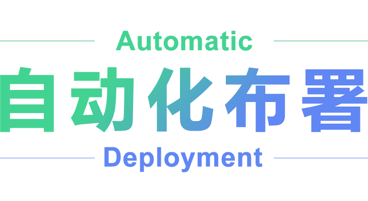

# webpack-automatic-deployment

<p align="center">

</p>

> webpack把代码打包后自动布署到服务器中
process.env.NODE_ENV === "production" 时才会打包上传

## Installation 安装

```console
npm install webpack-automatic-deployment --save-dev
# OR
yarn add webpack-automatic-deployment --dev
# OR
pnpm add webpack-automatic-deployment --save-dev
```

## Usage 使用

This plugin will delete the files on the server for you and upload the packaged files to the server. Just add the plugin to your webpack config as follows:
该插件将为您把服务器上的文件删除，并把打包后的文件上传到服务器中，只需要您将插件添加到 webpack 配置中，如下所示:

**webpack.config.js**
```js
const WebpackAutomaticDeployment = require('webpack-automatic-deployment')

module.exports = {
  plugins: [
    new WebpackAutomaticDeployment(Options)
  ]
}
```
## Options 配置

You can pass a hash of configuration options to webpack-automatic-deployment. Allowed values are as follows:
您可以将配置的选项传递给 webpack-automatic-deployment 插件。允许的值如下：

|Name键名|Explain说明|Type类型|Description描述|
|:--:|:--:|:--:|:----------|
|**`host`**|**ServerIP/服务器IP**|**`{string}`**|example/例: 123.123.123.124|
|**`port`**|**ServerPort/服务器端口**|**`{number}`**|default: 22|
|**`username`**|**ServerUsers/服务器用户名**|**`{string}`**|example/例: root|
|**`password`**|**ServerPassword/服务器密码**|**`{string}`**|example/例: ****|
|**`remotePath`**|**ProjectPath/项目路径**|**`{string}`**|example/例: /root/www/project_demo|

Here's an example webpack config illustrating how to use these options
下面是一个示例 webpack 配置，说明如何使用这些选项

webpack使用方法：配置**webpack.config.js**
```js
{
  plugins: [
    new WebpackAutomaticDeployment({
      host: 'your server ip',
      username: 'your server users',
      password: 'your server password',
      remotePath: 'your project path on the server '
    })
  ]
}
```

vue cli使用方法：配置**vue.config.js**
```js
const WebpackAutomaticDeployment = require("webpack-automatic-deployment");

module.exports = {
  plugins: [new WebpackAutomaticDeployment({
      host: 'your server ip',
      username: 'your server users',
      password: 'your server password',
      remotePath: 'your project path on the server '
    })],
};

```

🔥 After configuration, run the **npm run build** command to automatically upload and deploy the code to the server after packaging

💪 配置好后，运行 **npm run build** 命令即可实现代码打包后自动上传部署至服务器

⚠️ **Attention：**
* 1.The configuration in the project should have process.env.NODE_ ENV is the value of production, otherwise the plugin will not take effect
* 2.The project path on the server needs to be specified to the project folder, as the folder will be deleted before each upload

⚠️ **特别注意：**
* 1.项目中配置的要有process.env.NODE_ENV为production的值，否则插件不会生效
* 2.服务器上的项目路径要指定到**项目文件夹**，因为每次上传前会先删除文件夹
     + 如：您项目上传服务器的地址为：/root/www，你的项目文件夹名为 project_demo，那么对应配置的时候remotePath的值应为：/root/www/project_demo
